# CUDA / TensorRT packages in the Autoware workspace

A catalog of every ROS package in this workspace that depends on NVIDIA **CUDA**,
**TensorRT**, or **cuDNN**, what each one does, and how they stack on top of the shared
CUDA/TensorRT wrapper libraries.

**🔗 Live interactive dependency graph: <https://xmfcx.github.io/autoware-cuda-graph/>**

## Summary

| Scope | Count |
|---|---|
| **Total CUDA/TensorRT packages** | **31** |
| in `autoware_universe` | 27 |
| in external repos (`src/universe/external/`) | 3 |
| in launcher (`autoware_launch`) | 1 (launch aggregator, no GPU code) |

GPU usage is classified as:

- **meta/stub** — virtual package, no GPU code
- **CUDA kernels (N .cu)** — ships custom CUDA kernels, no TensorRT
- **TensorRT** — runs TensorRT inference (directly or via a wrapper)
- **TensorRT + kernels (N .cu)** — both custom kernels and TensorRT inference
- **CUDA buffers** — GPU memory/transport layer, no kernels or inference
- **launch aggregator (indirect)** — only `exec_depend`s on GPU nodes; builds no GPU code

## Package table

### autoware_universe — common (1)

| Package | What it does | GPU usage |
|---|---|---|
| `autoware_cuda_dependency_meta` | Virtual "switch" package providing an empty CUDA stub, so dependents can build with or without CUDA. | meta/stub |

### autoware_universe — sensing (3)

| Package | What it does | GPU usage |
|---|---|---|
| `autoware_cuda_utils` | Shared CUDA utility library: device memory/stream management, error checking, thrust helpers. | CUDA kernels (5 .cu) |
| `autoware_cuda_pointcloud_preprocessor` | GPU point-cloud preprocessing: concatenation, downsampling, outlier removal, cropping. | CUDA kernels (8 .cu) |
| `autoware_calibration_status_classifier` | Detects LiDAR-camera miscalibration with a small TensorRT classifier. | TensorRT + kernels (1 .cu) |

### autoware_universe — perception (21)

| Package | What it does | GPU usage |
|---|---|---|
| `autoware_tensorrt_common` | TensorRT utility wrapper + profiler; the common TensorRT engine/runtime abstraction. | TensorRT |
| `autoware_tensorrt_plugins` | Custom TensorRT CUDA plugins (bev_pool, scatter, argsort, rotate, etc.) shared by several models. | TensorRT + kernels (7 .cu) |
| `autoware_tensorrt_classifier` | Generic TensorRT image-classifier wrapper with a CUDA preprocessing kernel. | TensorRT + kernels (1 .cu) |
| `autoware_tensorrt_yolox` | YOLOX object detector on TensorRT with a CUDA preprocessing kernel. | TensorRT + kernels (1 .cu) |
| `autoware_tensorrt_bevdet` | Autoware wrapper node around the `bevdet_vendor` BEVDet TensorRT implementation. | TensorRT (via `bevdet_vendor`) |
| `autoware_tensorrt_bevformer` | BEVFormer multi-camera 3D detection on TensorRT (deformable-attention plugins). | TensorRT + kernels (5 .cu) |
| `autoware_lidar_centerpoint` | CenterPoint LiDAR 3D object detection. | TensorRT + kernels (4 .cu) |
| `autoware_lidar_transfusion` | TransFusion LiDAR 3D object detection. | TensorRT + kernels (3 .cu) |
| `autoware_lidar_frnet` | FRNet LiDAR point-cloud semantic segmentation. | TensorRT + kernels (2 .cu) |
| `autoware_ptv3` | Point Transformer v3 LiDAR 3D detection. | TensorRT + kernels (2 .cu) |
| `autoware_bevfusion` | BEVFusion camera+LiDAR multi-view 3D object detection. | TensorRT + kernels (4 .cu) |
| `autoware_camera_streampetr` | StreamPETR streaming camera 3D object detection. | TensorRT + kernels (4 .cu) |
| `autoware_lidar_apollo_instance_segmentation` | Apollo CNN LiDAR instance segmentation. | TensorRT |
| `autoware_image_projection_based_fusion` | RoI/point-painting camera-LiDAR fusion (reuses CenterPoint). | TensorRT + kernels (1 .cu) |
| `autoware_ground_segmentation_cuda` | GPU-accelerated ground segmentation filter. | CUDA kernels (1 .cu) |
| `autoware_probabilistic_occupancy_grid_map` | GPU probabilistic occupancy-grid-map generation (Bayes/binary filters). | CUDA kernels (5 .cu) |
| `autoware_shape_estimation` | Bounding-box shape estimation for detected objects, with an optional TensorRT ML corrector. | TensorRT |
| `autoware_bytetrack` | ByteTrack multi-object tracking. | TensorRT (via wrappers) |
| `autoware_simpl_prediction` | SIMPL multi-agent trajectory prediction. | TensorRT |
| `autoware_traffic_light_classifier` | Traffic-light color/state classification (uses the TensorRT classifier/yolox wrappers). | TensorRT |
| `autoware_traffic_light_fine_detector` | Fine-grained traffic-light detection via YOLOX. | TensorRT |

### autoware_universe — planning (1)

| Package | What it does | GPU usage |
|---|---|---|
| `autoware_diffusion_planner` | Diffusion-model-based motion planner running on TensorRT. | TensorRT |

### autoware_universe — e2e (1)

| Package | What it does | GPU usage |
|---|---|---|
| `autoware_tensorrt_vad` | VAD (Vectorized Autonomous Driving) end-to-end driving node on TensorRT. | TensorRT + kernels (3 .cu) |

### External repos — `src/universe/external/` (3)

| Package | Parent repo | What it does | GPU usage |
|---|---|---|---|
| `bevdet_vendor` | `bevdet_vendor` | Vendored BEVDet TensorRT implementation with custom CUDA kernels and plugins. | TensorRT + kernels (8 .cu) |
| `cuda_blackboard` | `cuda_blackboard` | Zero-copy CUDA buffer "blackboard" for passing GPU memory between nodes without device↔host copies. | CUDA buffers |
| `trt_batched_nms` | `trt_batched_nms` | TensorRT batched non-maximum-suppression plugin. | TensorRT + kernels (6 .cu) |

### Launcher — `autoware_launch` (1)

| Package | Parent repo | What it does | GPU usage |
|---|---|---|---|
| `tier4_perception_launch` | `autoware_launch` | Launch file aggregator; `exec_depend`s on 14 of the CUDA perception nodes but builds no GPU code itself. | launch aggregator (indirect) |

> All packages above except `tier4_perception_launch` live in `autoware_universe` unless a
> "Parent repo" column says otherwise.

## Dependency graph

Arrows point **from a package to the package it depends on** (`dependent --> dependency`).
The foundation libraries sit at the bottom; consumers stack upward. `tier4_perception_launch`
is intentionally omitted (it only launches these nodes, it does not build against them).
The three roots — `autoware_cuda_dependency_meta`, `cuda_blackboard`, and `bevdet_vendor` —
depend only on the system CUDA/TensorRT install, not on any other workspace package.

> **🔗 Live interactive graph: <https://xmfcx.github.io/autoware-cuda-graph/>**
> — a force-directed graph: drag nodes, zoom/pan, hover to trace a package's dependencies,
> and click a tier in the legend to filter. Source: [`index.html`](index.html)
> (loads D3 from a CDN, so it needs internet).

```mermaid
flowchart TD
    %% ---- composite consumers ----
    autoware_traffic_light_classifier --> autoware_tensorrt_classifier
    autoware_traffic_light_classifier --> autoware_tensorrt_common
    autoware_traffic_light_classifier --> autoware_cuda_utils
    autoware_traffic_light_classifier --> autoware_cuda_dependency_meta
    autoware_traffic_light_fine_detector --> autoware_tensorrt_yolox
    autoware_traffic_light_fine_detector --> autoware_cuda_dependency_meta
    autoware_image_projection_based_fusion --> autoware_lidar_centerpoint
    autoware_image_projection_based_fusion --> autoware_cuda_dependency_meta

    %% ---- model / inference + GPU-preproc nodes ----
    autoware_bevfusion --> autoware_tensorrt_plugins
    autoware_bevfusion --> autoware_tensorrt_common
    autoware_bevfusion --> autoware_cuda_utils
    autoware_bevfusion --> cuda_blackboard
    autoware_bevfusion --> autoware_cuda_dependency_meta
    autoware_ptv3 --> autoware_tensorrt_plugins
    autoware_ptv3 --> autoware_tensorrt_common
    autoware_ptv3 --> autoware_cuda_utils
    autoware_ptv3 --> cuda_blackboard
    autoware_ptv3 --> autoware_cuda_dependency_meta
    autoware_lidar_centerpoint --> autoware_tensorrt_common
    autoware_lidar_centerpoint --> autoware_cuda_utils
    autoware_lidar_centerpoint --> cuda_blackboard
    autoware_lidar_centerpoint --> autoware_cuda_dependency_meta
    autoware_lidar_frnet --> autoware_tensorrt_common
    autoware_lidar_frnet --> autoware_cuda_utils
    autoware_lidar_frnet --> cuda_blackboard
    autoware_lidar_frnet --> autoware_cuda_dependency_meta
    autoware_lidar_transfusion --> autoware_tensorrt_common
    autoware_lidar_transfusion --> cuda_blackboard
    autoware_lidar_transfusion --> autoware_cuda_dependency_meta
    autoware_camera_streampetr --> autoware_tensorrt_common
    autoware_camera_streampetr --> autoware_cuda_utils
    autoware_camera_streampetr --> autoware_cuda_dependency_meta
    autoware_lidar_apollo_instance_segmentation --> autoware_tensorrt_common
    autoware_lidar_apollo_instance_segmentation --> autoware_cuda_utils
    autoware_lidar_apollo_instance_segmentation --> autoware_cuda_dependency_meta
    autoware_bytetrack --> autoware_tensorrt_common
    autoware_bytetrack --> autoware_cuda_utils
    autoware_bytetrack --> autoware_cuda_dependency_meta
    autoware_shape_estimation --> autoware_tensorrt_common
    autoware_shape_estimation --> autoware_cuda_utils
    autoware_shape_estimation --> autoware_cuda_dependency_meta
    autoware_simpl_prediction --> autoware_tensorrt_common
    autoware_simpl_prediction --> autoware_cuda_utils
    autoware_tensorrt_vad --> autoware_tensorrt_common
    autoware_tensorrt_vad --> autoware_tensorrt_plugins
    autoware_diffusion_planner --> autoware_tensorrt_plugins
    autoware_diffusion_planner --> autoware_tensorrt_common
    autoware_diffusion_planner --> autoware_cuda_utils
    autoware_diffusion_planner --> autoware_cuda_dependency_meta
    autoware_tensorrt_bevformer --> autoware_cuda_dependency_meta
    autoware_tensorrt_bevdet --> bevdet_vendor
    autoware_calibration_status_classifier --> autoware_tensorrt_common
    autoware_calibration_status_classifier --> autoware_cuda_utils
    autoware_probabilistic_occupancy_grid_map --> autoware_cuda_utils
    autoware_probabilistic_occupancy_grid_map --> autoware_cuda_dependency_meta
    autoware_cuda_pointcloud_preprocessor --> autoware_cuda_utils
    autoware_cuda_pointcloud_preprocessor --> cuda_blackboard
    autoware_cuda_pointcloud_preprocessor --> autoware_cuda_dependency_meta
    autoware_ground_segmentation_cuda --> autoware_cuda_pointcloud_preprocessor
    autoware_ground_segmentation_cuda --> autoware_cuda_utils
    autoware_ground_segmentation_cuda --> cuda_blackboard
    autoware_ground_segmentation_cuda --> autoware_cuda_dependency_meta

    %% ---- shared TensorRT building blocks ----
    autoware_tensorrt_plugins --> autoware_cuda_utils
    autoware_tensorrt_plugins --> autoware_cuda_dependency_meta
    autoware_tensorrt_classifier --> autoware_tensorrt_common
    autoware_tensorrt_classifier --> autoware_cuda_utils
    autoware_tensorrt_classifier --> autoware_cuda_dependency_meta
    autoware_tensorrt_yolox --> autoware_tensorrt_common
    autoware_tensorrt_yolox --> autoware_cuda_utils
    autoware_tensorrt_yolox --> autoware_cuda_dependency_meta
    trt_batched_nms --> autoware_tensorrt_common
    trt_batched_nms --> autoware_cuda_utils

    %% ---- core wrappers ----
    autoware_tensorrt_common --> autoware_cuda_dependency_meta
    autoware_cuda_utils --> autoware_cuda_dependency_meta

    %% ---- styling by tier ----
    classDef foundation fill:#e0e0e0,stroke:#616161,color:#000;
    classDef util fill:#bbdefb,stroke:#1565c0,color:#000;
    classDef trtblock fill:#c8e6c9,stroke:#2e7d32,color:#000;
    classDef model fill:#ffe0b2,stroke:#ef6c00,color:#000;
    classDef composite fill:#fff9c4,stroke:#f9a825,color:#000;

    class autoware_cuda_dependency_meta,cuda_blackboard,bevdet_vendor foundation;
    class autoware_cuda_utils,autoware_tensorrt_common util;
    class autoware_tensorrt_plugins,autoware_tensorrt_classifier,autoware_tensorrt_yolox,trt_batched_nms trtblock;
    class autoware_bevfusion,autoware_ptv3,autoware_lidar_centerpoint,autoware_lidar_frnet,autoware_lidar_transfusion,autoware_camera_streampetr,autoware_lidar_apollo_instance_segmentation,autoware_bytetrack,autoware_shape_estimation,autoware_simpl_prediction,autoware_tensorrt_vad,autoware_diffusion_planner,autoware_tensorrt_bevformer,autoware_tensorrt_bevdet,autoware_calibration_status_classifier,autoware_probabilistic_occupancy_grid_map,autoware_cuda_pointcloud_preprocessor,autoware_ground_segmentation_cuda model;
    class autoware_traffic_light_classifier,autoware_traffic_light_fine_detector,autoware_image_projection_based_fusion composite;
```

<details>
<summary>Static Mermaid version (click to expand)</summary>



</details>

## How the layering works

The packages form five tiers, bottom to top:

- **Foundation** — `autoware_cuda_dependency_meta` (the build-time CUDA on/off switch),
  `cuda_blackboard` (zero-copy GPU buffer transport), and the vendored `bevdet_vendor`.
  These depend only on the system CUDA/TensorRT install.
- **Core wrappers** — `autoware_cuda_utils` (CUDA memory/stream helpers) and
  `autoware_tensorrt_common` (the TensorRT engine/runtime abstraction). Almost everything
  builds on these.
- **Shared TensorRT building blocks** — `autoware_tensorrt_plugins`,
  `autoware_tensorrt_classifier`, `autoware_tensorrt_yolox`, and `trt_batched_nms`:
  reusable inference components consumed by multiple model nodes.
- **Model / inference + GPU-preproc nodes** — the detection, segmentation, tracking,
  prediction, planning, and point-cloud-preprocessing nodes.
- **Composite consumers** — nodes built on top of other model nodes:
  `autoware_traffic_light_classifier` (→ `autoware_tensorrt_classifier`),
  `autoware_traffic_light_fine_detector` (→ `autoware_tensorrt_yolox`), and
  `autoware_image_projection_based_fusion` (→ `autoware_lidar_centerpoint`).

## How this list was generated

The package set is every `package.xml` that references a CUDA/TensorRT token:

```bash
# from the workspace root (/home/mfc/projects/autoware)
find src -name package.xml -exec grep -liE 'cuda|tensorrt|cudnn|nvinfer' {} + | wc -l   # -> 31
```

> Note: plain `grep -r ... src` does not descend this workspace's tree reliably; drive grep
> with `find ... -exec` instead.

GPU-usage classification per package was derived from `.cu` file counts and
`find_package(CUDA*/TENSORRT)` / `NvInfer.h` usage. The graph edges are the CUDA-set
entries among each package's `<depend>` / `<build_depend>` / `<exec_depend>` tags.
